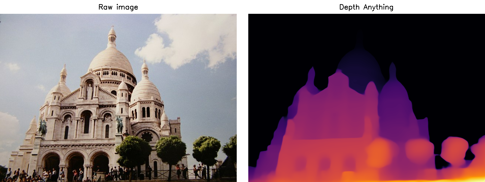
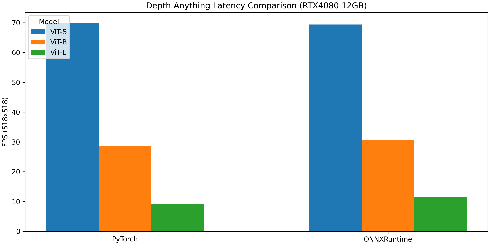

[](https://onnx.ai/)
[](https://github.com/fabio-sim/Depth-Anything-ONNX/stargazers)
[](https://github.com/fabio-sim/Depth-Anything-ONNX/releases)

# Depth Anything ONNX

Open Neural Network Exchange (ONNX) compatible implementation of [Depth Anything: Unleashing the Power of Large-Scale Unlabeled Data](https://github.com/LiheYoung/Depth-Anything).

<p align="center">

<details>
<summary>Changelog</summary>

- **22 January 2024**: Release.
</details>

## 🔥 ONNX Export

Prior to exporting the ONNX models, please install the [requirements](/requirements.txt).

To convert the Depth Anything models to ONNX, run [`export.py`](/export.py). The pretrained weights will be downloaded automatically.

<details>
<summary>Export Example</summary>
<pre>
python export.py --model s
</pre>
</details>

If you would like to try out inference right away, you can download ONNX models that have already been exported [here](https://github.com/fabio-sim/Depth-Anything-ONNX/releases).

## ⚡ ONNX Inference

With ONNX models in hand, one can perform inference on Python using ONNX Runtime. See [`infer.py`](/infer.py).

<details>
<summary>Inference Example</summary>
<pre>
python infer.py --img assets/DSC_0410.JPG --model weights/depth_anything_vits14.onnx --viz
</pre>
</details>

## 🚀 TensorRT Support

(To be investigated)

## ⏱️ Inference Time Comparison

<p align="center">

We report the inference time, or latency, of only the model; that is, the time taken for preprocessing, postprocessing, or copying data between the host & device is not measured. The average inference time is defined as the median over all samples in the [MegaDepth](https://arxiv.org/abs/1804.00607) test dataset. We use the data provided by [LoFTR](https://arxiv.org/abs/2104.00680) [here](https://github.com/zju3dv/LoFTR/blob/master/docs/TRAINING.md) - a total of 806 images.

Each image is resized such that its size is 518x518 before being fed into the model. The inference time is then measured for all model variants (S, B, L). See [eval.py](/eval.py) for the measurement code.

All experiments are conducted on an i9-12900HX CPU and RTX4080 12GB GPU with `CUDA==11.8.1`, `torch==2.1.2`, and `onnxruntime==1.16.3`.

### Notes

- Currently, the inference speed is bottlenecked by Conv operations.
- ONNXRuntime performs slightly (20-25%) faster for the ViT-L model variant.

## Credits
If you use any ideas from the papers or code in this repo, please consider citing the authors of [Depth Anything](https://arxiv.org/abs/2401.10891) and [DINOv2](https://arxiv.org/abs/2304.07193). Lastly, if the ONNX versions helped you in any way, please also consider starring this repository.

```bibtex
@article{depthanything,
      title={Depth Anything: Unleashing the Power of Large-Scale Unlabeled Data}, 
      author={Yang, Lihe and Kang, Bingyi and Huang, Zilong and Xu, Xiaogang and Feng, Jiashi and Zhao, Hengshuang},
      journal={arXiv:2401.10891},
      year={2024}
}
```

```bibtex
@misc{oquab2023dinov2,
  title={DINOv2: Learning Robust Visual Features without Supervision},
  author={Oquab, Maxime and Darcet, Timothée and Moutakanni, Theo and Vo, Huy V. and Szafraniec, Marc and Khalidov, Vasil and Fernandez, Pierre and Haziza, Daniel and Massa, Francisco and El-Nouby, Alaaeldin and Howes, Russell and Huang, Po-Yao and Xu, Hu and Sharma, Vasu and Li, Shang-Wen and Galuba, Wojciech and Rabbat, Mike and Assran, Mido and Ballas, Nicolas and Synnaeve, Gabriel and Misra, Ishan and Jegou, Herve and Mairal, Julien and Labatut, Patrick and Joulin, Armand and Bojanowski, Piotr},
  journal={arXiv:2304.07193},
  year={2023}
}
```

